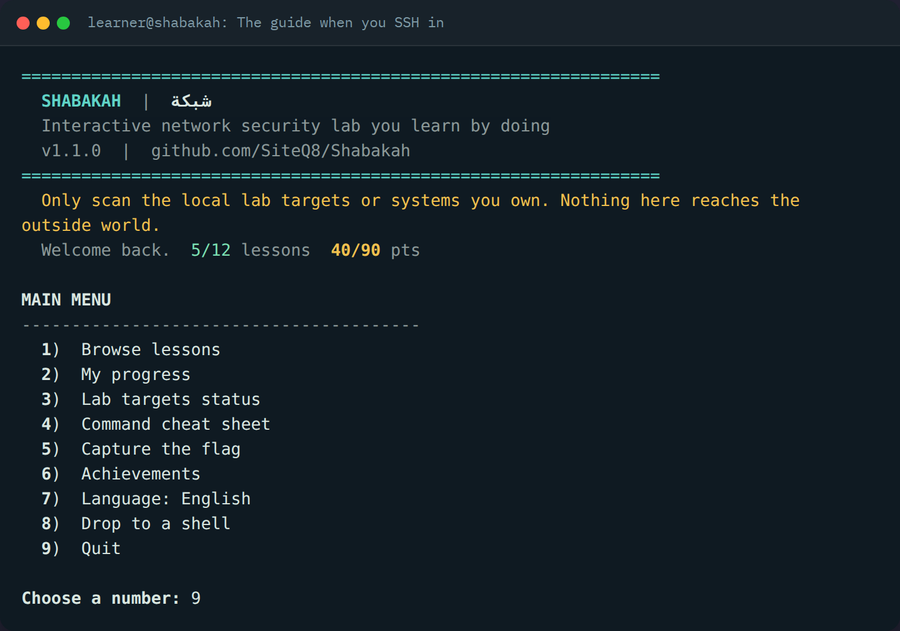
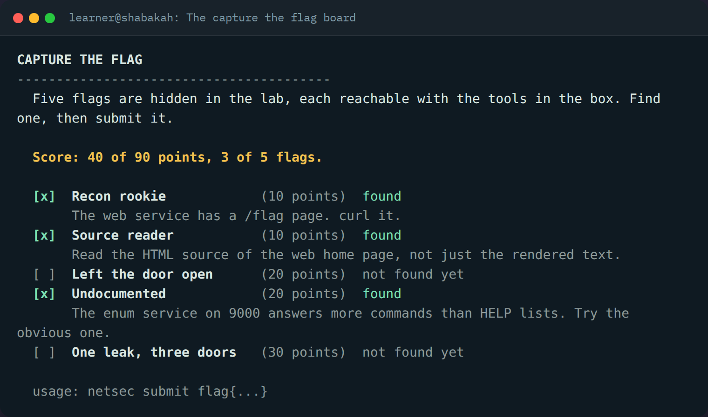
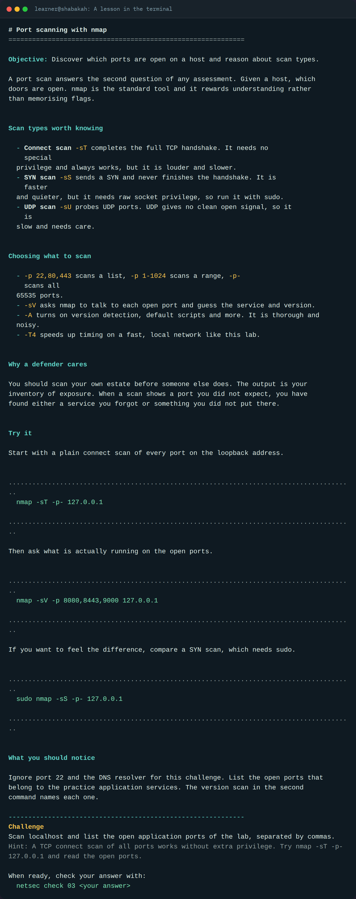
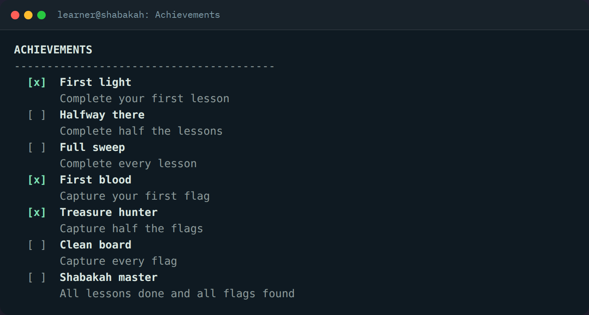

# Shabakah (شبكة)

A network security lab you SSH into to learn by doing.

[](https://github.com/SiteQ8/Shabakah/actions/workflows/docker-image.yml)
[](https://github.com/SiteQ8/Shabakah/releases)
[](LICENSE)
[](https://github.com/SiteQ8/Shabakah/pkgs/container/shabakah)

Shabakah is a single self contained Docker container. You start it, you SSH in,
and a bilingual guide walks you through twelve hands on lessons against real
services running beside it. Every challenge is checked live, so you learn by
doing, not by reading. There is also a five flag capture the flag hunt and a set
of achievements to earn. Nothing here reaches the outside world, so you can
practise scanning, capture, and enumeration safely.

Built and maintained by Ali AlEnezi (SiteQ8). Available in English and Arabic.

Website: https://shabakah.3li.info



## Quick start

With Docker Compose:

```
git clone https://github.com/SiteQ8/Shabakah.git
cd Shabakah
docker compose up -d --build
ssh -p 2222 learner@localhost
```

The default password is `shabakah`. Change it with the `LEARNER_PASSWORD`
environment variable before using this anywhere shared.

Or pull the prebuilt image from the GitHub Container Registry:

```
docker run -d --name shabakah --cap-add NET_ADMIN -p 2222:22 ghcr.io/siteq8/shabakah:latest
ssh -p 2222 learner@localhost
```

`NET_ADMIN` is only needed for the firewall lesson. Everything else works
without it.

## What is inside

Shabakah is three things wrapped in one container.

A guide called `netsec` that carries every lesson, shows the objective and the
challenge, then verifies your answer against the running services in real time.
Your progress is saved between sessions.

Six live practice targets, each one there so a lesson has something honest to
find, from a chatty web service to a forgotten cleartext console.

A capture the flag hunt of five flags worth ninety points, plus seven
achievements that unlock as you clear lessons and capture flags.



## The lessons

Twelve lessons, each ending in a live challenge the guide checks for you.

| # | Lesson | Focus |
|---|--------|-------|
| 01 | The lay of the land | See what is listening and read the shape of the host |
| 02 | Grab the banners | Service banners and the HTTP headers that give a host away |
| 03 | Scan the ports | Map open application ports with nmap |
| 04 | Enumerate a service | Make a raw TCP service tell you its version |
| 05 | Cleartext is a finding | Catch a password sent in the clear |
| 06 | Capture the traffic | Read loopback traffic with tcpdump |
| 07 | Inspect the certificate | Read a TLS certificate and its subject with openssl |
| 08 | Shape the firewall | Write nftables rules and watch them take effect |
| 09 | Resolve names | Query the lab DNS resolver and read each record type |
| 10 | Think like a defender | Turn findings into least privilege and safer defaults |
| 11 | UDP services and why they hide | Scan and speak to a UDP service that answers only when asked |
| 12 | Chaining findings into access | Follow a trail from a small leak all the way to a login |



## The practice targets

| Port | Service | What it is for |
|------|---------|----------------|
| tcp 8080 | Cleartext web | Banner, hidden paths, and a page it should never expose |
| tcp 8443 | TLS web | The same service over TLS with a self signed certificate |
| tcp 9000 | Enumeration service | A chatty banner and an undocumented command to uncover |
| tcp 2323 | Cleartext console | A forgotten console that reuses a password |
| udp 5353 | Lab DNS resolver | An offline resolver for the shabakah.lab zone |
| udp 9001 | UDP banner service | A UDP service that stays silent until you speak its protocol |

## Capture the flag

Five flags are hidden across the targets, each reachable with the tools in the
box. Find one, then submit it.

```
netsec ctf                     show the board and your score
netsec ctf hint <flag-id>      show where a flag is hidden
netsec submit flag{...}        submit a flag you found
netsec achievements            show your badges
```

Lesson twelve walks the full chain from one small leak to real access, so the
hunt doubles as a lesson in how a real assessment actually runs.



## Driving the guide

```
netsec                    open the interactive guide
netsec lessons            list all lessons
netsec lesson <id>        read one lesson
netsec check <id> <a>     check your challenge answer
netsec targets            show which targets are up
netsec cheat              command cheat sheet
netsec progress           show your progress and score
netsec ctf                show the capture the flag board
netsec submit flag{...}   submit a flag you found
netsec achievements       show unlocked achievements
netsec lang [en|ar]       get or set the language
```

## The toolbox

The container ships with a working network security kit so nothing needs
installing mid lesson: nmap, tcpdump, ngrep, openssl, dig, whois, netcat, socat,
curl, wget, hping3, nftables, iptables, mtr, and traceroute.

## Safety

Every practice service binds inside the container and nothing reaches the
outside world. You get to run the aggressive tools the aggressive way with no
risk to anyone, which is exactly why a contained lab is the right place to learn
them. Only ever scan the lab targets or systems you own.

## Languages

Every lesson, prompt, and hint is written in both English and Arabic. Switch any
time with `netsec lang ar` or `netsec lang en`, or from the menu, and your
progress follows.

## Building from source

```
docker build -t shabakah:latest .
docker run -d --name shabakah --cap-add NET_ADMIN -p 2222:22 shabakah:latest
```

The lab content lives under `lab/`. Lessons are markdown with a small front
matter block in `lab/lessons/<lang>/`. The guide is `lab/bin/netsec` and the
practice services are `lab/targets/targets.py`, both plain Python 3 with no
dependencies. Run the offline test suite with `sh tests/smoke.sh`.

## Contributing

New lessons, new targets, and translations are welcome. See CONTRIBUTING.md for
how the pieces fit together. To report a security issue, see SECURITY.md.

## License

MIT. See LICENSE. Built by Ali AlEnezi (SiteQ8).

---

## عن شبكة

شبكة مختبر لأمن الشبكات تدخل إليه عبر SSH فتتعلم بالممارسة، وهو حاوية Docker
واحدة ومكتفية بذاتها تشغّلها ثم تدخل إليها فيرحّب بك مرشد ويأخذك عبر اثني عشر
درسا عمليا على خدمات حقيقية تعمل بجانبها، ويُتحقق من كل تحدٍّ حيا. يوجد أيضا صيد
لخمسة أعلام وسبع شارات إنجاز تكسبها، ولا شيء هنا يصل إلى الخارج فتتدرب على الفحص
والالتقاط والتعداد بأمان.

للبدء اسحب الصورة أو ابنها ثم شغّلها بأمر `docker compose up -d --build` ثم ادخل
بأمر `ssh -p 2222 learner@localhost`، وبدّل اللغة إلى العربية بأمر
`netsec lang ar`، وكلمة المرور الافتراضية `shabakah` فغيّرها قبل أي استخدام
مشترك.

الموقع https://shabakah.3li.info والترخيص MIT وبناه علي العنزي.
